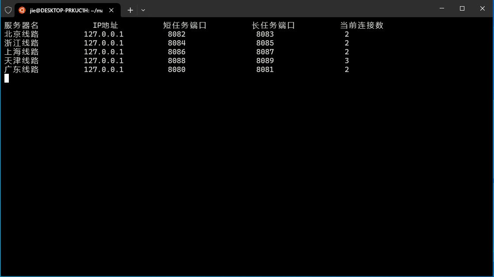
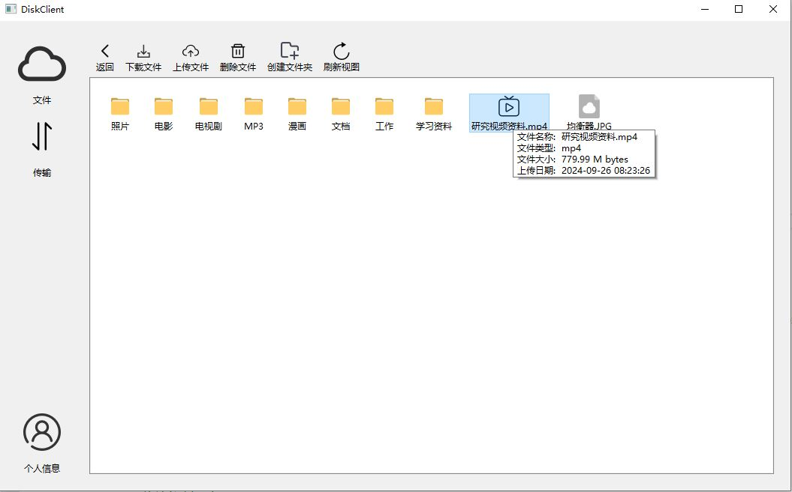
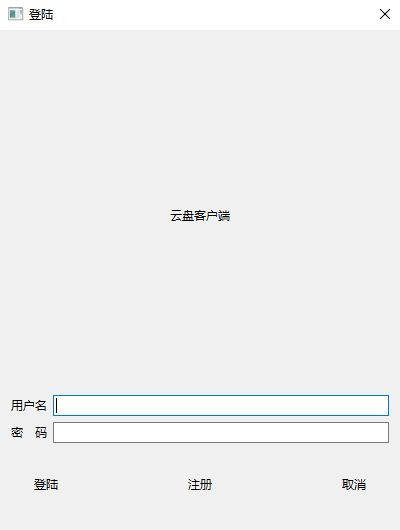
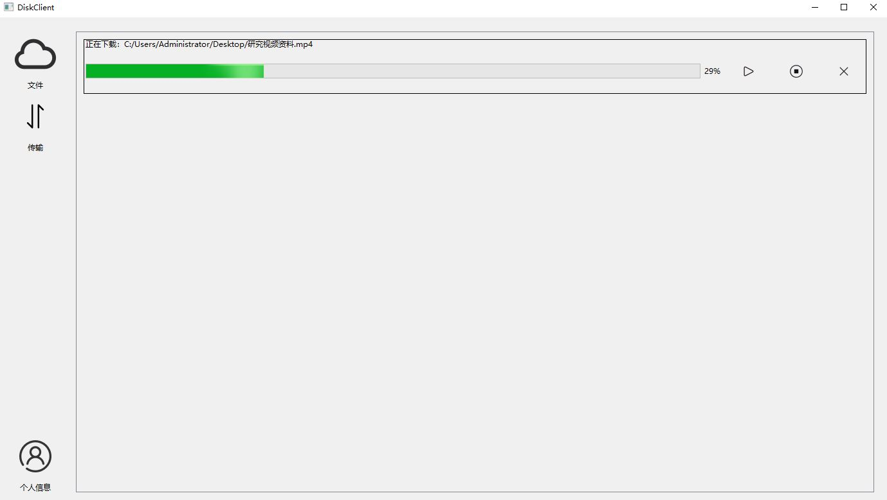
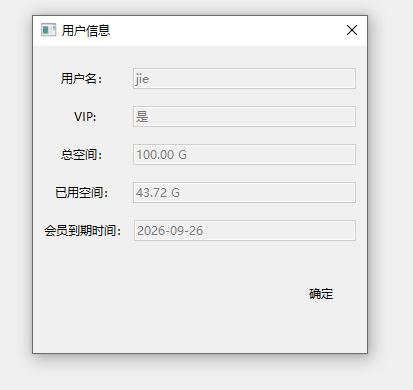

# C++  NetDisk

[TOC]

创建人：杰
联系方式：905680036@qq.com

# 一、基本架构（服务端Linux,客户端Qt)

## (一)、服务端结构

1、Linux系统

2、Epoll IO复用模型：高效的Epoll边缘触发IO复用

3、线程池：采取主线程（处理连接，派发任务，与均衡器通信。不进行其它IO操作）+子线程（执行客户端任务，进行IO操作）模式，实现了线程池

4、数据库连接池（单例模式）：采用MySql的Connector/C++ 数据库框架，并配合RAII机制，实现一个自动申请和释放的数据库连接池

5、OpenSSL(安全套接字传输)：使用Openssl框架实现，客户端与服务端之间安全加密传输，保护传输安全

6、Openssl文件校验：才是Openssl,对文件进行SHA256计算，并利用计算结果作为文件名，实现妙传，和文件传输校验。

7、基于小根堆的定时器：采用小根堆作为底层数据结构，实现了一个定时器，将长期不活跃的连接释放，减少服务器负载

8、分级日记系统（单例模式）：使用多线程对日记进行写入。日记级别分为：Debug、info、warn、error。可根据情况不同写入不同日记，并自动记录时间。

9、任务处理（工厂模式）：长（上传、下载等）短（登陆注册等）任务分离。使用多态实现客户端连接。一个抽象任务类下面继承实现多个具体任务类，根据客户端任务请求，生成不同对象，进行处理。长任务采取状态机处理：Check->Doing->Fin->Close.四种状态间转换处理。

10、负载均衡：实现一个简单负载均衡服务器。用来根据各服务器的当前负载量，派发客户端连接。该均衡器较为简单，仅供参考，不建议使用。现在云服务提供商基本都提供安全的均衡策略。

11、公平调度（轮询算法）：并不会一个线程把全部任务处理完成，而是只处理该任务的一部分，然后在处理下个任务，使用轮询机制，避免大任务长期占用线程，导致其它任务无法得到处理，例如一个客户上传100G的文件，客户端的网速又不好，如果一个线程完全处理，会导致其它任务长期难以响应。


## (二)客户端结构

1、Window系统（使用Qt跨平台框架，也可简单部署到其它系统）

2、Openssl安全加密传输

3、Asio库作为通信基础

4、短任务线程池。长任务多线程传输，避免UI界面冻结。

5、实现文件系统视图，可以进行层级化查看文件

6、界面与逻辑分离




# 二、快速搭建

## （一）服务器

1、安装c++开发套件（已经安装可跳过）

```
sudo apt update
sudo apt install build-essential gdb -y			//安装gdb必须套件
gcc -v && g++ -v && make -v			//查看是否安装成功
```


2、安装Openssl

```
sudo apt-get install openssl
openssl version    //查看是否安装成功

//安装openssl开发工具包
sudo apt install libssl-dev

//命令行终端生成证书私钥等。会让你填写一些信息，可跳过
openssl genpkey -algorithm RSA -out server.key -pkeyopt rsa_keygen_bits:2048
openssl req -new -key server.key -out server.csr
openssl req -x509 -days 365 -key server.key -in server.csr -out server.crt

```

3、配置数据库

安装数据库（这个详细可以自行网上搜索）这个只给出简单方法，通过Linux命令行执行

```
sudo apt-get update

sudo apt-get install mysql-server			//安装
sudo systemctl start mysql					//启动
sudo systemctl enable mysql    				//设置开机自启动
sudo mysql_secure_installation        //安全配置脚本，运行后会让你做出一些选择。这里需要注意选择root账号需要密码登陆，设置完后在更改root密码。否则会出现数据库无法连接

设置完成后修改mysql用户密码
然后运行mysql终端执行下面命令
```

这里只讲解设置数据库。

```
//Myslq终端创建数据库
CREATE DATABASE Netdisk;

//切换数据库
use Netdisk

//创建用户表
CREATE TABLE `Users` (
  `User` varchar(50) CHARACTER SET utf8mb4 COLLATE utf8mb4_0900_ai_ci NOT NULL,
  `Password` varchar(50) CHARACTER SET utf8mb4 COLLATE utf8mb4_0900_ai_ci NOT NULL,
  `Cipher` text NOT NULL,
  `IsVip` tinyint(1) NOT NULL DEFAULT '0' COMMENT 'isvip',
  `CapacitySum` bigint DEFAULT '107374182400' COMMENT 'The total capacity sum',
  `usedCapacity` bigint DEFAULT '0' COMMENT 'used capacity',
  `Salt` char(8) DEFAULT NULL,
  `VipDate` date DEFAULT NULL,
  PRIMARY KEY (`User`)
) ENGINE=InnoDB DEFAULT CHARSET=utf8mb4 COLLATE=utf8mb4_0900_ai_ci

//创建文件表
CREATE TABLE `FileDir` (
  `Fileid` bigint unsigned NOT NULL AUTO_INCREMENT COMMENT 'fileID',
  `User` varchar(50) CHARACTER SET utf8mb4 COLLATE utf8mb4_0900_ai_ci NOT NULL,
  `FileName` varchar(255) NOT NULL,
  `DirGrade` int unsigned NOT NULL DEFAULT '0',
  `FileType` varchar(10) NOT NULL,
  `MD5` varchar(200) CHARACTER SET utf8mb4 COLLATE utf8mb4_0900_ai_ci DEFAULT NULL,
  `FileSize` bigint unsigned DEFAULT NULL,
  `ParentDir` bigint unsigned DEFAULT '0' COMMENT 'PatentDir ID',
  `FileDate` datetime NOT NULL DEFAULT CURRENT_TIMESTAMP COMMENT 'FILE PUT DATA',
  PRIMARY KEY (`Fileid`,`User`)
) ENGINE=InnoDB AUTO_INCREMENT=255 DEFAULT CHARSET=utf8mb4 COLLATE=utf8mb4_0900_ai_ci
```

```
退出Myslq终端，回到Linux命令行安装Mysql c++开发框架
apt-get install libmysqlcppconn-dev
```

常见问题

```
ERROR 1045 (28000): Access denied for user ‘root’@‘localhost’。  这个问题是数据库安装时候安全配置没设计好，一般把root用户设置必须密码登陆即可。
```

4、填写配置文件（server_config.cfg)  .自行根据自己情况填写，这份只做参考。参数依次为：服务器地址、短任务端口、长任务端口、sql用户名、数据库密码、数据库名、连接池数量、数据库端口、线程池数量、日记队列数量、超时时间（毫秒为单位）、均衡器IP、均衡器端口、连接均衡器的密码、服务器名、是否连接均衡器false为不连接，true连接（如果选true必须提前启动均衡器，否则服务器无法运行）

```
[Server]
host =127.0.0.1
port =8080
upPort =8081
sqlUser =root
sqlPwd =7664
dbName =Netdisk
connPoolNum =10
sqlport =3306
threadNum =10
logqueSize =10
timeout =1800000

[Equalizer]
EqualizerIP =127.0.0.1
EqualizerPort =9090
EqualizerKey =abc9988220
servername =广东服务
IsConEualizer=false
```

5、在程序运行文件夹下，创建日记保存文件夹 logfile 和文件保存文件夹rootfiles. 自己也可以改，但是需要进入源代码function头文件修改即可，修改服务器的读取路径。如果配置无误，你的项目结构应该如下

```
->bin
->code
  ->buffer
  ->Log
  ->pool
  ->server
  ->sql
  ->timer
  ->tool
  function.h
  main.cpp
->logfile
->rootfiles
makefile
server_config.cfg
server.crt
server.csr
server.key
```

```
最后命令行终端,输入以下命令编译
make

//编译完成后，命令行终端输入以下命令运行服务器

./bin/server
```

## （二）客户端

​	需要安装Qt6.6.2以上版本。拷贝下来整个文件，正常的话打.sin文件即可。注意在客户端项目中function头文件，修改自己的均衡器和默认服务器地址。

```
//在客户端的function文件修改以下代码成为自己的服务器地址

#define MainServerIP "127.0.0.1"    //负载均衡器地址
#define MainServerPort 9091         //负载均衡器端口
#define DefaultserverIP "127.0.0.1" //默认服务器地址，负载均衡器无法工作，将会默认使用它
#define DefaultserverSPort 8080		//默认服务器短任务端口
#define DefaultserverLPort 8081		//默认服务器长任务端口
```


# 三、服务器

## （一）通信协议

保存在头文件function中，该头文件保存着服务端与客户端的通信协议和通信包。

```
//服务端主进程和客户端通信协议
struct PDU
{
    int PDUcode=0;            //命令，如login、sign等
    char user[20]={0};      //用户名，非中文，最大20字节
    char pwd[20]={0};       //密码，初始未明文密码，登陆后为hash认证码
    char filename[100]={0};     //文件名（未使用MD5算法加密的），最大长度100，可中文
    int len=0;              //备用空间长度，如果大于0，说明reserve有数据需要读取
    char reserve[200]={0}; //备用空间缓存区
};


//用于文件上传和下载的通信协议
struct TranPdu{
    int TranPduCode=0;  //命令
    char user[20]={0};  //用户名
    char pwd[20]={0};   //密码
    char filename[100]={0}; //文件名
    char FileMd5[100]={0};  //文件MD5码
    std::uint64_t filesize=0;   //文件长度
    std::uint64_t sendedsize=0; //实现断点续传的长度
    std::uint64_t parentDirID=0;    //保存在哪个目录下的ID，为0则保存在根目录下.也可在进行下载任务时候指定要下载的文件ID
};

//状态码
enum Code{
    LogIn=1,    //客户端要进行登陆操作
    SignIn,     //客户端要进行注册操作
    Puts,       //客户端要进行上传操作
    Gets,       //客户端要进行下载操作
    CD,         //客户端要读取文件信息
    MAKEDIR,    //客户端要创建文件夹
    DELETEFILE,     //客户端要删除文件

    CodeOK,    //回复OK
    CodeNO,    //回复NO
    ClientShut, //客户端关闭
    CapacityNO, //云盘空间不足
    FileNOExist,//文件不存在

    PutsContinue,   //断点上传
    PutsContinueNO,   //断点上传失败，从0开始
    PutQUICKOK,       //相同的文件已经存在，妙传
    GetsContinueNO,     //断点下载失败
};


//服务器简版回复客户端包体
struct ResponsePack
{
    int code=0;         //状态码
    int len=0;          //缓存空间大小  
    char buf[200]={0};  //最长200
};


//用户信息结构体，对应数据库用户表
struct UserInfo
{
    char username[USERSCOLMAXSIZE]={0};
    char pwd[USERSCOLMAXSIZE]={0};
    char cipher[USERSCOLMAXSIZE]={0};
    char isvip[USERSCOLMAXSIZE]={0};
    char capacitySum[USERSCOLMAXSIZE]={0};
    char usedCapacity[USERSCOLMAXSIZE]={0};
    char salt[USERSCOLMAXSIZE]={0};
    char vipdate[USERSCOLMAXSIZE]={0};  
};

//文件信息体,即保存在数据库中的文件和文件夹
struct FILEINFO{
    std::uint64_t FileId;       //文件在数据库的id
    char Filename[100]={0};     //文件名，最长100字节
    int DirGrade=0;             //目录等级，距离根目录距离，用来构建文件给客户端界面系统
    char FileType[10]={0};      //文件类型，如d为目录，f为文件，也可以拓展MP3等
    std::uint64_t FileSize;     //文件大小
    std::uint64_t ParentDir;    //父文件夹的ID，指明文件保存在哪个文件夹下面
    char FileDate[100]={0};     //文件创建时间
};
```


## （二）日记系统(Buffer、BlockDeque、Log)

### 1、Buffer类

​	该类使用C++实现了一个智能缓存区，能够往缓冲区写入数据与读取数据。其特征有：

​	1、在空间不足时候自动拓展空间，并保持对原空间数据的可读。

​	2、自动更新读写位置，例如有100字节数据。如果只读取10字节，它会自动将读指针指向11字节处。下次读取将从偏移量为11处读取。

​	3、支持多种原始类型对象往里面写入数据，如（string、char数组，void *）等，并能转换成string

​	4、使用原子操作，保护线程安全

使用方法：

  	1、读取：先调用Peek返回读取的起始位置，再调用ReadableBytes()返回可供读取字节数。然后读取数据，自由选择读取长度len，再调用Retrieve标志已经读取len字节数据
  	
  	2、写入：先调用BeginWrite()返回写入位置指针，再调用WritableBytes()返回可写入字节数，然后往缓冲区自由写入len字节数，然后调用HasWritten(size_t len)标志写入多少字节，如果空间不够调用EnsureWriteable(size_t len)增加空间，增加空间后需要重新返回写入位置。

​	3、调用Append直接加入缓冲区（有四个重载版本），函数内部会自动拓展空间和更改位置指针

​	4、往文件字柄读取数据和写入数据，调用ReadFd(int fd, int* Errno);和WriteFd(int fd, int* Errno);

```
class Buffer {
public:
    Buffer(int initBuffSize = 1024);
    ~Buffer() = default;

    //属性函数，用于返回类的相关属性
    size_t WritableBytes() const;       //返回可用来写入的字节数
    size_t ReadableBytes() const ;      //返回缓存区可供读取字节数
    size_t PrependableBytes() const;    //返回读区指针的位置，也可用作为预留空间位置，因为写指针前面的空间已经读取完了，代表可用重新使用

    const char* Peek() const;           //返回当前可读数据指针，若程序进行读取，重这里开始读取
    const char* BeginWriteConst() const;//返回缓存区写入位置指针，const版本，只读，不可进行写操作
    char* BeginWrite();                 //返回缓存区写入位置指针，可以进行写操作，即写入数据从这里开始写入
    void EnsureWriteable(size_t len);   //检查缓冲区是否还有len字节的可用空间，如果没有则增加
    

    //用于修改类的相关属性

    void HasWritten(size_t len);            //标志已经写入len字节数据，并让写坐标增加len字节
    void Retrieve(size_t len);              //标志已经读取了多少字节
    void RetrieveUntil(const char* end);    //将缓存区已经读取位置标志到end
    void RetrieveAll() ;                    //清空缓冲区，将readPos和writePos置0
    std::string RetrieveAllToStr();         //将缓存区的全部数据转为string来返回,并清空

    //将数据追加到缓冲区

    void Append(const std::string& str);        //追加写入一个string字符串进缓冲区
    void Append(const char* str, size_t len);   //将str字符数组的len字节数据写入缓存区
    void Append(const void* data, size_t len);  //将data void数组转换成字符数组，并将其中len字节的数据追加写入缓冲区
    void Append(const Buffer& buff);            //将其它Buffer对象的数据拷贝到缓冲区，从读取位置开始的全部字节

    ssize_t ReadFd(int fd, int* Errno);         //将套接字fd字柄的数据读入缓冲区，若出错则更新saveErrno,以提醒其它工作流程，并返回读取的字节数。
    ssize_t WriteFd(int fd, int* Errno);        //将缓冲区的数据可供读取的数据写入套接字fd,如果出错更改saveErrno以提醒其它工作流程，返回写入的字节长度

private:
    char* BeginPtr_();                  //返回缓存区起始地址 非const版本
    const char* BeginPtr_() const;      //返回缓存区起始地址 const版本
    void MakeSpace_(size_t len);        //缓存区不足后，拓展len字节空间


    std::vector<char> buffer_;          //内部缓冲区，用vector实现
    std::atomic<std::size_t> readPos_;  //用于确保多线程安全操作的类，内部保存一个size_t对象，指向缓冲区读取下标位置
    std::atomic<std::size_t> writePos_; //用于确保多线程安全操作的类，内部保存一个size_t对象，指向缓冲区写入下标位置
};
```


### 2、BlockDeque类

​	BlockDeque 是一个线程安全的阻塞队列模板类，使用生产者与消费者模型，适用于多线程环境下的数据传递与同步。使用流程：先调用构造函数初始化队列最大空间，然后在生产者线程中调用push_back，把数据压入队列，然后唤醒消费者线程使用pop取出数据进行处理。需要往线程传递该对象引用适合用于异步作业：如异步日记系统。

```
template<class T>
class BlockDeque {
public:
    explicit BlockDeque(size_t MaxCapacity = 1000); //模板构造函数，传递一个Size_t 构造阻塞队列最大空间
    ~BlockDeque();    //析构函数，将阻塞队列清空，并关闭双端队列，不在接受任何处理。并唤醒全部生产者和消费者线程

    bool empty();     //返回阻塞队列是否为空，空则为true
    bool full();      //返回阻塞队列是否满。满则为true
    size_t size();    //返回队列当前元素数量
    size_t capacity();  //返回队列总可用空间

    void Close();     //将阻塞队列清空，并关闭双端队列，不在接受任何处理。并唤醒全部生产者和消费者线程
    void clear();     //清空阻塞队列

    void push_back(const T &item);  //将元素item插入队列尾部，并唤醒消费者线程
    void push_front(const T &item); //将元素item插入到队列头部，并唤醒一个消费者线程
    T front();          //返回队头元素
    T back();           //返回队尾元素
    bool pop(T &item);              //将队列头部元素取出保存在item中，并返回是否成功
    bool pop(T &item, int timeout); //将队列头部元素取出保存在item中，并返回是否成功，非阻塞版本，等待超时则返回false
    void flush();                   //唤醒一个消费者进程，该线程对作业进行处理
private:
    std::deque<T> deq_;     //存储数据元素的双端队列
    size_t capacity_;       //队列的空间大小
    std::mutex mtx_;        //互斥量
    bool isClose_;          //是否关闭队列
    std::condition_variable condConsumer_;  //消费者等待条件变量
    std::condition_variable condProducer_;  //生产者等待条件变量
};
```

### 3、Log类

Log类是个支持同步或者异步的日志系统，使用单例模式进行构建。保证全局只有唯一实例将日志系统分为三个级别：0：debug、1：info、2：warn、3：error，可用调用SetLevel设置记录的日志最低级别，如级别2，则0和1不会记录，提高系统性能。

使用方法：先调用Instance()返回唯一实例，然后通过实例调用init初始化，最后即可调用四个宏定义写入日记。

​	例如LOG_INFO("client %s login",user.c_str()); 需要注意设置日记文件的保持路径，如下面的./logfile 目录。

```
class Log {
public:
    void init(int level, const char* path = "./logfile", const char* suffix =".log",int maxQueueCapacity = 1024);

    static Log* Instance();         //获取日记类的唯一单例
    static void FlushLogThread();   //刷新日志线程，使线程异步写入日志,用于传递给线程的运行函数，构造线程

    void write(int level, const char *format,...);  //传递日志级别（0:debug、1:info、2:warn、3：error），格式化字符串，将该字符串写入日记文件
    void flush();                   //将文件指针中的数据写入系统内核，存入文件

    int GetLevel();                 //获取当前日志级别，0:debug、1:info、2:warn、3：error，低于这个级别的日记不会被写入，如为3，怎0 1 2 都不会被记录
    void SetLevel(int level);       //设置当前日志级别，0:debug、1:info、2:warn、3：error
    
    //日志系统是否开始
    bool IsOpen() { return isOpen_; }   
    
private:
    Log();                          		//构造函数，初始化成员变量，默认为同步写入
    void AppendLogLevelTitle_(int level);    //析构函数
    virtual ~Log();
    void AsyncWrite_();                     //异步写入日记

private:
    static const int LOG_PATH_LEN = 256;    //日志保存路径最大长度
    static const int LOG_NAME_LEN = 256;    //日志名最大长度
    static const int MAX_LINES = 50000;     //单个日志文件记录最大行数

    const char* path_;      //日志文件路径
    const char* suffix_;    //日志文件后缀名

    int MAX_LINES_;         //日志文件最大行数

    int lineCount_;         //当前日志文件行数
    int toDay_;             //当前日志文件日期

    bool isOpen_;           //是否开始日志
 
    Buffer buff_;           //日志缓存区
    int level_;             //日志级别
    bool isAsync_;          //是否异步写入，1则为异步

    FILE* fp_;              //日志文件指针
    std::unique_ptr<BlockDeque<std::string>> deque_;    //阻塞队列智能指针，内部存储string
    std::unique_ptr<std::thread> writeThread_;          //异步写入日志线程智能指针
    std::mutex mtx_;                                    //互斥锁
};

//统一调用写入日志宏定义，输入日记等级（0:debug、1:info、2:warn、3：error），和格式化字符串，写入日记
#define LOG_BASE(level, format, ...) \
    do {\
        Log* log = Log::Instance();\
        if (log->IsOpen() && log->GetLevel() <= level) {\
            log->write(level, format, ##__VA_ARGS__); \
            log->flush();\
        }\
    } while(0);

#define LOG_DEBUG(format, ...) do {LOG_BASE(0, format, ##__VA_ARGS__)} while(0);
#define LOG_INFO(format, ...) do {LOG_BASE(1, format, ##__VA_ARGS__)} while(0);
#define LOG_WARN(format, ...) do {LOG_BASE(2, format, ##__VA_ARGS__)} while(0);
#define LOG_ERROR(format, ...) do {LOG_BASE(3, format, ##__VA_ARGS__)} while(0);
```


## （三）线程池（任务队列）

​	使用C++ std::function函数对象实现的一个具有通用性的线程池模板，内部使用生产者与消费者模型进行线程同步。主线程往任务队列添加任务，多条子线程循环重中取出任务，并执行。该线程池具有一定安全线，可以避免任务出错导致主线程或者子线程崩溃。使用方法示例

```
void task(int i){......}	//任务函数
WorkQue m_workque(10);	//初始化10条子线程
int num=10;
m_workque.AddTask(std::bind(task,num));	//往线程池添加该任务，子线程自动取出执行
```

```
//任务队列
class WorkQue{
public:
    explicit WorkQue(size_t threadCount=10);
    WorkQue()=default;
    WorkQue(WorkQue &&)=default;
    ~WorkQue();

    template<class F>                        //往线程池添加作业
    void AddTask(F &&task);
private:
    std::mutex mutex;   				//互斥量
    std::condition_variable con;    	 //条件变量
    std::queue<std::function<void()>>deq;                 //任务队列
    bool isClose=false;                   				//线程池是否关闭，1为关闭
};

//往线程池添加作业
template <class F>
inline void WorkQue::AddTask(F &&task)
{
    if(isClose==true)return;
    {
        std::lock_guard<std::mutex>locker(mutex);
        deq.emplace(std::forward<F>(task));
    }
    con.notify_one();
}
```


## （四）SQL连接池（单例模式实现）

```
使用实例
SqlConnPool *pool=sqlConnPool::Insrance();	//获取全局唯一实例
pool->init("127.0.0.1","root","1234","Netdisk",10);
Mydb db;
db.getinfo(user,pwd);
```

### 1、SqlConnPool类

一个使用信号量和互斥量保证线程安全和线程通信的MYSQL连接池。可供复用，减少系统IO调用。使用方法：先调用Instance()返回全局唯一实例，再通过唯一实例调用init()初始化，再调用GetConn获取一个连接，使用完后调用FreeConn将其放回连接池最佳使用方:配合sqlconnRAII类使用，该类封装了自动释放连接，避免手动释放。

```
class SqlConnPool {
public:
    // 获取单例实例
    static SqlConnPool* Instance();

    // 禁止拷贝构造和赋值
    SqlConnPool(const SqlConnPool&) = delete;
    SqlConnPool& operator=(const SqlConnPool&) = delete;

    // 初始化连接池
    void Init(const std::string& host, const std::string& user, const std::string& password, 
              const std::string& database, int connSize = 10);

    // 获取一个连接
    std::shared_ptr<sql::Connection> GetConn();

    // 释放连接
    void FreeConn(std::shared_ptr<sql::Connection> conn);

    // 获取当前可用连接数
    int GetFreeConnCount();

    // 关闭连接池
    void ClosePool();

private:
    // 私有构造函数，防止外部创建实例
    SqlConnPool() = default;
    ~SqlConnPool();

    // 数据成员
    int maxConn_;                                  // 最大连接数
    std::queue<std::shared_ptr<sql::Connection>> connQueue_;  // 连接队列
    std::mutex mtx_;                               // 互斥锁
    std::condition_variable cond_;                 // 条件变量，用于线程间通信
    sql::Driver* driver_;                          // MySQL 驱动
};
```

### 2、RAII类

​	MYSQL连接池的RAII类，可以在构造时候申请连接对象，离开作用域自动放回连接池。资源在对象构造初始化资源在对象析构时释放。

```
class SqlConnRAII {
public:
    // 构造函数，传递一个连接对象的共享指针和连接池指针
    SqlConnRAII(std::shared_ptr<sql::Connection>& sql, SqlConnPool *connpool) {
        assert(connpool);
        sql = connpool->GetConn();
        connpool_ = connpool;
        sql_ = sql;
    }
    // 自动将连接放回连接池
    ~SqlConnRAII() {
        if (sql_) { connpool_->FreeConn(sql_); }
    }
private:
    std::shared_ptr<sql::Connection> sql_;
    SqlConnPool* connpool_;
};
```

### 3、MyDb类

​	该类为主要接口类，服务器使用数据库时，主要使用该类的API进行数据库处理。主要方便封装起来方便操作。私有函数是通用查询，公有函数是具体任务查询（同个调用私有函数进行）

```
class MyDb 
{
private:
    static std::string tablename;    // 表名
    static std::string Columns1;     // 字段1
    static std::string Columns2;     // 字段2
public:
    MyDb();
    ~MyDb();

    // 查询接口
    bool getUserInfo(const std::string &username, const std::string &password, UserInfo &info);             //查询用户信息
    bool getUserExist(const std::string &username);                                                         //查询用户是否存在
    bool insertUser(const std::string &username, const std::string &password, const std::string &cipher);   //插入用户
    bool GetFileMd5(const std::string &user, const std::uint64_t &fileid,string &md5);                      //获取文件MD5
    bool GetISenoughSpace(const std::string &username, const std::string &password,std::uint64_t filesize); //检查空间是否足够
    bool getFileExist(const std::string &username,const std::string &MD5);                                  //查询是否已经存在该文件，支不支持妙传
    bool getUserAllFileinfo(const std::string &username,vector<FILEINFO>&vet);                              //获取用户在数据库中的全部文件信息
    std::uint64_t insertFiledata(const string &user,UDtask *task,const string &suffix);                     //插入文件数据
    bool deleteOneFile(const string &user,std::uint64_t &fileid);                                           //删除单个文件
    bool deleteOneDir(const string &user,std::uint64_t &fileid);                                            //删除文件夹
private:
    bool executeSelect(const std::string &sql, const std::vector<std::string> &params, std::vector<std::string>& result);
    bool executealter(const std::string &sql, const std::vector<std::string> &params);
    bool executeSelect(const std::string &sql, const std::vector<std::string> &params, std::vector<vector<string>>& result);
    std::shared_ptr<sql::Connection> conn;
    SqlConnRAII* connRAII = nullptr;
};
```

## 

## （五）多态的客户端连接类（主要用来对客户端进行分类处理）

### 1、抽象连接类（抽象类，主要用于在服务器主线程实现多态）

​	多态：即父类指针或者引用指向子类实例，根据子类不同，执行的功能不同。

​	该类里面有个枚举类型：用来表明，该客户端属于哪里客户端。方便后续根据任务类型生成指定工厂对任务进行处理

```
class AbstractCon{
public:
    static std::atomic<int>userCount;       //连接总数
    AbstractCon()=default;
    virtual ~AbstractCon(){}		//注意：这里必须是虚析构函数，否则会内存泄漏
    virtual void Close()=0;			//让子类实现，不同子类有不同关闭逻辑

	//获取属性函数
    void setVerify(const bool &status);
    SSL *getSSL()const;
    int getsock()const;
    string getuser()const;
    string getpwd()const;
    bool getisVip()const;
    bool getIsVerify()const;
    void closessl();
    
    enum ConType{SHOTTASK=0,LONGTASK,PUTTASK,GETTASK,GETTASKWAITCHECK};
    int ClientType=0;       	//客户端类型，0为短任务，1长任务，2为上传，3为下载,4为下载完毕等待客户端检查文件数据无误
protected:
    SSL *m_clientSsl=nullptr;     //客户端ssl套接字
    int m_clientsock;             //客户端sock
    UserInfo m_userinfo;          //用户信息体
    bool m_isVerify=false;        //客户端是否已经进行登陆认证，用来确定能否进行其它操作
    bool m_isClose=false;         //客户端是否已经关闭
    bool m_isVip=false;           //是否vip用户
};
```

### 	2、ClientCon类（即短任务连接类,如登陆，注册）

```
class ClientCon:public AbstractCon{
public:
    ClientCon(int sockFd,SSL *_ssl);
    ClientCon()=default;
    ~ClientCon();

    void init(const UserInfo &info);	//使用从数据库检索处理的用户信息结构体，进行初始化
    void Close();		//重载关闭方法
};
```

### 	3、UpDownCon类（即长任务连接类，如上传，下载等）

​	该类有个结构UDtsk,该结构用于保存任务的执行信息。如上传信息，上传文件名等。其中还有一个枚举类型，用于实现状态机。子线程执行时候可以返回状态，根据状态的不同执行不同操作。因为一个任务并不是由一个子线程完全处理。

```
//上传和下载任务结构体
struct UDtask{
    int TaskType=AbstractCon::ConType::LONGTASK;                       //任务类型，默认为长任务，后期再改上传或者下载
    std::string Filename;               //文件名
    std::string FileMD5;                //文件存储在磁盘中的MD5码
    std::uint64_t total=0;              //文件总字节大小
    std::uint64_t handled_Size=0;       //已经处理大小
    std::uint64_t parentDirID=0;        //保存在哪个文件夹下，默认为0根目录
    int File_fd=-1;                     //文件套接字
    char *FileMap=nullptr;              //文件内存映射mmap
};

//该类专门负责处理长时间耗时操作的连接，如上传文件和下载文件,并用原子类型保证线程安全
class UpDownCon:public AbstractCon{
public:
    UpDownCon(int sockFd,SSL *_ssl);            
    UpDownCon()=default;
    ~UpDownCon();
    UpDownCon& operator=(const UpDownCon &other);           // 手动实现赋值运算符
    void init(const UserInfo &info,const UDtask &task);     //初始化任务
    void Close();                                           //关闭连接
    enum UDStatus{START=0,DOING,PAUSE,FIN,COLSE};          //状态机状态枚举变量，分别为：开始、上传下载中、暂停，完成,关闭
    void SetStatus(UDStatus status);                       //修改当前任务状态
    UDtask* GetUDtask();                                    //获取任务结构体指针
    int GetStatus();                                        //返回当前任务状态
private:
    std::atomic<int> m_status{0};                                //状态变量
    UDtask m_task;                                				//任务体
};
```

## （六）定时器（Timer)

以最小堆作为存储结构的定时器类，可以设定一个超时时间，在超时后指向回调函数（如断开连接），内部保持有序。按最近超时放在堆顶。内部使用映射加快查询速度。每个定时器拥有唯一id（如使用套接字fd作为定时器id）

简单使用方法：先使用构造函数构造一个对象。再调用add(),添加,再调用GetNextTick返回是否有超时，有则调用tick()把超时的删除。 或者直接调用doWork删除指定id定时器。注意：以毫秒为单位，如输入int time=3600000; 则将超时时间定为3600000毫秒，即1小时。

```
struct TimerNode{
    int id;         //定时器id
    TimeStamp expires;  //剩余时间数
    TimeoutCallBack cb; //回调函数

    //重载小于运算符，用于堆排序
    bool operator<(const TimerNode &t)
    {
        return expires<t.expires;
    }
};

class Timer
{
public:
    //构造函数，初始时候预留64个空间
    Timer(){heap_.reserve(64);}
    ~Timer(){clear();}              //析构函数，清空堆数据

    void adjust(int id, int newExpires);    //传递定时器id,并将其时间延迟到系统当前时间+timeout毫秒。    
    void add(int id, int timeOut, const TimeoutCallBack& cb); //指定一个定时器id,和初始超时时间，和回调函数，将其添加进堆中。
    void doWork(int id);        //传递定时器id，运行该定时器回调函数，并将其从堆中删除
    void clear();               //清空堆，将其重置
    void tick();                //循环清除全部超时结点 
    void pop();                 //删除堆的顶部结点
    int GetNextTick();          //返回最近超时的定时器剩余时间，如果以及有超时的返回0.堆为空返回-1
private:
    void del_(size_t i);        //传递指定节点的下标，并将其删除,删除后并调整堆结构
    void siftup_(size_t i);     //传递一个定时器在堆数组中的下标，并根据它的超时时间剩余数，往上移，保持最小堆结构
    bool siftdown_(size_t index, size_t n); //传递定时器在堆中的索引和堆长度，调整堆结构。如果该定时器超时时间大过子节点，则往下循环交换
    void SwapNode_(size_t i, size_t j);     //将堆中两个位置（数组中下标）的数据交互，并更新映射表的映射    
private:
    std::vector<TimerNode>heap_;    //构建堆的底层容器，存储定时器结点
    std::unordered_map<int,size_t>ref_; //定时器结点ID到堆位置的映射
};
```

##  （七）SR_Tool(Tcp收发数据类)

​	该类主要封装了OpelSsl安全套接字实现，加密数据传输。保证数据传输过程的私密性。并且封装了发送和接受服务器与客户端交互的协议接口。只需要调用即可发送数据，隐藏Tcp发送繁琐细节。

```
使用示例
SR_Tool obj;
obj.sendPDU(m_con->getssl(),m_pdu); //向客户端发送通信协议包m_pdu. m_con是连接类，例如ClientCon
```


```
class SR_Tool
{
public:
    SR_Tool()=default;
    ~SR_Tool()=default;
    size_t sendPDU(SSL *ssl,const PDU &pdu); //安全套接字层发送PDU
    size_t recvPDU(SSL *ssl,PDU &pdu);                  //安全套接字接收PDU
    size_t recvTranPdu(SSL *ssl,TranPdu &pdu);          //安全套接字接受TranPdu
    size_t sendReponse(SSL *ssl,const ResponsePack &response);  //安全套接字服务器回复简易包体
    size_t recvReponse(SSL *ssl,ResponsePack &response);  //安全接收客户端简易响应包体
    size_t sendUserInfo(SSL *ss,const UserInfo &info);  //使用ssl发生客户信息
    bool sendFileInfo(SSL *ssl,const vector<FILEINFO>&vet); //使用ssl把文件信息全部发送回客户端
};
```

##  （八）任务系统（工厂模式）

### 	1、AbstractTool(抽象工具类)

​	主要实现多态和一些共同操作，具体操作由具体子类操作。子类必须重写doing()函数

```
class AbstractTool{
public:
    AbstractTool()=default;
    virtual ~AbstractTool(){}
    virtual int doingTask()=0;
protected:
    SR_Tool sr_tool;
    std::string getSuffix(const std::string& filename); //获取文件后缀名
};
```

### 	2、ShortTaskTool类（短任务操作类）

​	该系统主要分为五个类，分别实现了：登陆功能、注册功能、查询文件列表功能、创建文件夹功能、删除文件夹功能。若是后期想拓展功能，如添加分享文件、好友等功能，只需要在这里新建一个类，并继承AbstractTool即可拓展。无需改动其它类。做的开闭原则。

```
//负责Login任务
class LoginTool:public AbstractTool{
public:
    LoginTool(const PDU &_pdu,AbstractCon *_con):m_pdu(_pdu),m_conParent(_con){}
    int doingTask();
private:
    PDU m_pdu;  
    AbstractCon *m_conParent=nullptr;
};


//负责Sign工具
class SignTool:public AbstractTool{
public:
    SignTool(const PDU &_pdu,AbstractCon *_con):m_pdu(_pdu),m_conParent(_con){}
    int doingTask();
private:
    bool createDir();
    PDU m_pdu;
    AbstractCon *m_conParent=nullptr;
};


//负责处理返回给客户端文件列表功能，仅限已经认证客户端操作
class CdTool:public AbstractTool{
public:
    CdTool(const PDU &_pdu,AbstractCon *_con):m_pdu(_pdu),m_conParent(_con){}
    int doingTask();
private:
    PDU m_pdu;
    AbstractCon *m_conParent=nullptr;
};

//负责创建文件夹
class CreateDirTool:public AbstractTool{
public:
    CreateDirTool(const PDU &_pdu,AbstractCon *_con):m_pdu(_pdu),m_con(static_cast<ClientCon*>(_con)){}
    int doingTask();
private:
    PDU m_pdu;
    ClientCon *m_con=nullptr;
};

//删除文件或者文件夹
class DeleteTool:public AbstractTool{
public:
    DeleteTool(const PDU &_pdu,AbstractCon *_con):m_pdu(_pdu),m_con(static_cast<ClientCon*>(_con)){}
    int doingTask();
private:
    PDU m_pdu;
    ClientCon *m_con=nullptr;
};
```

###  3、LongTaskTool（长任务类）

​	该系统包含两个类：上传处理类、下载处理类。后续如果需要拓展，如用户不需要下载视频，直接以流媒体形式发送回去给用户在线看，可以在这里添加新类进行处理。两个类都使用状态机实进行任务处理。

```
//负责上传任务
class PutsTool:public AbstractTool{
public:
    PutsTool(const TranPdu &_pdu,AbstractCon *_con):m_pdu(_pdu),m_conParent(_con){}
    PutsTool(AbstractCon *_con):m_conParent(_con){}
    int doingTask();
private:
    bool FirstCheck(UpDownCon *m_con);  //首次连接认证
    UDtask CreateTask(ResponsePack &respon,MyDb &db);    //生成任务结构体
    void RecvFileData(UpDownCon *m_con);        //读取数据
private:
    TranPdu m_pdu;
    AbstractCon *m_conParent=nullptr;
};

class GetsTool:public AbstractTool
{
public:
    GetsTool(const TranPdu &_pdu,AbstractCon *_con):m_pdu(_pdu),m_con(dynamic_cast<UpDownCon*>(_con)){};
    GetsTool(AbstractCon *_con):m_con(dynamic_cast<UpDownCon*>(_con)){}
    int doingTask();
private:
    bool FirstCheck();      //首次连接认证
    bool CreateTask(ResponsePack &respon,UDtask &task, MyDb &db);
    void SendFileData();
private:
    TranPdu m_pdu;
    UpDownCon *m_con=nullptr;
};
```

## （九）服务器主线程

### 1、Epoller类

该类用于简化Epoll事件操作，方便添加和移除监控套接字。并且可以多线程添加和移除。Linux内核确保多线程修改epoll描述符的安全性。

```
示例
Epoller epoller;
epoller.AddFd(clientsock,EPOLLIN|EPOLLOUT|EPOLLET);	//将clientsock套接字添加进epoll监控，监控事件为可读、可写、边缘触发
int count=epoller.Wait();	//开始IO监控

for(int i=0;i<count;i++)
{
	 int fd=m_epoll->GetEventFd(i);
      uint32_t events=m_epoll->GetEvents(i);
      if(fd==clientsock)
      	task(clientsock);	//处理任务
}
```


```
class Epoller {
public:
    explicit Epoller(int maxEvent = 1024);  //构造函数，传递最大epoll最大事件数，构造epoll，默认为1024

    ~Epoller();

    bool AddFd(int fd, uint32_t events);    //传递文件描述符fd，和事件events,将该文件描述符和事件关联，添加到epoll监控

    bool ModFd(int fd, uint32_t events);    //将文件描述符fd,关联的事件修改

    bool DelFd(int fd);                     //从epoll中删除文件描述符fd

    int Wait(int timeoutMs = -1);           //传递超时时间，等待epoll事件返回就绪文件描述符就绪数量，超时返回。默认-1，阻塞等待

    int GetEventFd(size_t i) const;         //返回第i个epool事件关联的文件描述符

    uint32_t GetEvents(size_t i) const;     //返回第i个事件类型
private:
    int epollFd_;       //epoll 文件描述符
    std::vector<struct epoll_event> events_;    //存储epoll事件的vec
};
```

### 2、主服务器类

该类是整个服务器的主循环类，由main函数构建该类，然后调用start()运行整个服务器.构建服务器传递的参数依次为：主机名（主机地址）、短任务端口、长任务端口、数据库用户名、数据库密码、数据库名、连接池线数量、数据库端口、线程池线程数、异步日记队列数、定期器超时时间（以毫秒为单位）、负载均衡器IP、负载均衡器端口、连接负载均衡器的密钥、本主机名（如广东线路服务器）、是否连接负载均衡器。 该服务区用两个sock负载分离客户端任务，一个处理短任务，一个处理长任务。还有一个sock用来与均衡器交互。

```
示例

int main()
{
	Server server(.........);
	Server.start();	//服务器运行
	return 0;
}
```


```
class Server
{
public:
    Server(const char *host, int port,int upPort, const char *sqlUser, const char *sqlPwd, const char *dbName, 
int connPoolNum, int sqlport, int threadNum, int logqueSize,int _timeout,const char *EqualizerIP,int EqualizerPort,const char *EqualizerKey,const string servername,bool isConEqualizer);
    ~Server();
    void start();   

//主要功能函数
private:
    int tcpInit(const char *ip,int port,int updownPort);       //初始化Tcp
    void CloseCon(AbstractCon *client);                        //关闭异常或者超时客户端
    void handleNewConnection(int select);                      //处理新连接
    void handleClientTask(AbstractCon *client);     		  //处理旧连接任务
    void createFactory(AbstractCon *con);   				 //创建工厂
//辅助主要功能的函数
private:
    bool ConnectEqualizer(const string &EqualizerIP,const int &EqualizerPort,const string &MineIP,const int MiniSPort,const int &MiniLPort,const string &servername,const string &key);
    void sendServerState(int state);
    void TimerSendServerState(int millisecond);
    int  SetFdNonblock(int fd);
    void SendError(int fd,const char *info);
    void AddClient(int clientfd, SSL *ssl,int select);
    std::shared_ptr<AbstractTool>GetTool(PDU &pdu,AbstractCon *con);
    std::shared_ptr<AbstractTool>GetTool(TranPdu &pdu,AbstractCon *con);
    
//成员变量
private:
    std::unique_ptr<WorkQue> m_workque;         //线程池，工作队列，用于添加任务
    std::unique_ptr<Timer> m_timer;             //用于处理定时器超时，断开超时无操作连接
    std::unique_ptr<Epoller>m_epoll;            //epoll字柄

    std::unordered_map<int,std::shared_ptr<AbstractCon>>m_clientcon;    //套接字与用户连接对象的映射
    int sockfd;               //服务端监听sock,处理新连接，处理短任务。如登陆，注册
    int timeoutMS_;           //超时时间，单位毫秒
    static const int MAX_FD = 65536;    //最大文件描述符数
    
    SSL_CTX *m_ctx=nullptr;     //安全套接字
    uint32_t listenEvent_;      //监听套接字默认监控事件：EPOLLRDHUP（对端关闭） EPOLLIN(可读事件) EPOLLET（边缘触发）
    uint32_t connEvent_;        //客户端连接默认监控事件：//连接默认监控事件EPOLLONESHOT（避免多线程操作出错，下次需要从新设置监听） | EPOLLRDHUP

    //处理长耗时操作
    int udsockfd;             //处理处理上传和下载任务的sockfd描述符
    int SockEqualizer=0;      //服务器与负载均衡器交互sock
    bool EqualizerUsed=false;//负载均衡器是否使用
}; 
```

## （十）负载均衡器

​	该均衡器使用基于小根堆实现，根据各服务器的负载情况，向客户端派发负载最低的服务器供客户端连接。该均衡器比较简单，仅仅作为简单示范，现实项目不建议使用。

```
struct ServerInfoPack{
    char servername[30]={0};
    char ip[20]={0};
    int sport;
    int lport;
    std::uint64_t curConCount=0;
    ServerInfoPack(const string &_ip,const int &_sport,const int &_lport,const string &_servername):sport(_sport),lport(_lport)
    {
        size_t len=_ip.size()>20?20:_ip.size();
        memcpy(ip,_ip.c_str(),len);

        len=_servername.size()>30?30:_servername.size();
        memcpy(servername,_servername.c_str(),len);
    }
    ServerInfoPack()=default;
};


#pragma pack(push, 1)
struct ServerState {
    int code = 0;                     // 状态码，0为正常，1为关闭
    std::uint64_t curConCount = 0;    // 当前连接数
};
#pragma pack(pop)   //禁止内存对齐，避免发送数据出错

class Equalizer{
public:
    Equalizer(std::string ip,int Port_server,int Port_Client,string key);
    ~Equalizer();
    void start();
private:
    bool tcpInit(std::string &ip,const int &port_server,const int &port_client);
    void handleNewServerConnection();         //处理新服务器连接
    void handleNewClientConnection();         //处理新客户端请求  

    void recvServerInfo(int sock);
    void recvServerPack(int sock);
    void updateServerState(int sock,size_t newConCount);
    void addServer(int sock,const size_t &count,const std::string &addr,const uint16_t &sPort,const uint16_t &lPort,const string &servername);
    void delServer(int sock);
    void sendServerInfoToClient(int sock);

    int SetFdNonblock(int sock);
    void displayServerInfo();
private:
    int m_sockAboutServer;        //与服务器通信的sock
    int m_sockAboutClient;        //与客户端通信的sock
    Epoller m_epoll;              //epll对象
    ServerHeap m_serverHeap;      //保存服务器数据的堆

    uint32_t listenEvent_=EPOLLRDHUP|EPOLLHUP|EPOLLERR|EPOLLIN|EPOLLET;        //监听事件类型

    string ConKey;      //连接负载均衡器的密码
};

int main()
{
    signal(SIGPIPE, SIG_IGN);       //必须忽略这个信号，否则均衡器非常容易崩溃
    Equalizer mainserver("127.0.0.1",9090,9091,"abc9988220");		//参数分别为：均衡器地址，处理服务器端口，处理客户端端口，连接均衡器密码
    mainserver.start();
    return 0;
}
```

## （十一）Main主函数和服务器配置文件

```
//读取服务器配置文件
std::unordered_map<std::string,std::string>readConfig(const std::string &filename);	//从程序运行路径读取配置文件，运行服务器
int main() {
    std::unordered_map<std::string,std::string> config = readConfig("server_config.cfg");

    // 读取服务器配置
    const char *host = config["Server.host"].c_str();
    int port = std::stoi(config["Server.port"]);
    int upPort = std::stoi(config["Server.upPort"]);
    const char *sqlUser = config["Server.sqlUser"].c_str();
    const char *sqlPwd = config["Server.sqlPwd"].c_str();
    const char *dbName = config["Server.dbName"].c_str();
    int connPoolNum = std::stoi(config["Server.connPoolNum"]);
    int sqlport = std::stoi(config["Server.sqlport"]);
    int threadNum = std::stoi(config["Server.threadNum"]);
    int logqueSize = std::stoi(config["Server.logqueSize"]);
    int timeout = std::stoi(config["Server.timeout"]);

    // 读取负载均衡器配置
    const char *EqualizerIP = config["Equalizer.EqualizerIP"].c_str();
    int EqualizerPort = std::stoi(config["Equalizer.EqualizerPort"]);
    const char *EqualizerKey = config["Equalizer.EqualizerKey"].c_str();
    const std::string servername = config["Equalizer.servername"];
    bool isConEqualizer=(config["Equalizer.IsConEualizer"]=="true");

    Server server(host, port, upPort, sqlUser, sqlPwd, dbName, connPoolNum, sqlport, threadNum, logqueSize, timeout,
                  EqualizerIP, EqualizerPort, EqualizerKey, servername,isConEqualizer);
    std::cout<<"服务器启动"<<std::endl;
    server.start();
    return 0;
}
```


# 四、客户端

## (一)SR_Tool类

​	该类是结合Asio库与Qt信号槽进行封装的用于方便与服务器进行报文交互的类。API包括：同步操作API、异步操作API. 已经信息槽，在触发事件后，将会发送相关信号，调用的类可以连接信息，触发相关处理函数。注意，该类只封装了方便ssl的操作，如果需要进行底层套接字操作，需要修改，或者使用gelssl.获得对象，再得到底层套接字，进行操作。

```
使用实例
string ip="127.0.0.1";
int port=8080;
SR_Tool tool(nullptr,ip,port);

asio::error_code ec;
tool.connect(ec);	//同步连接
tool.send(buf,ec);	//同步发送

//异步API
tool.async_connect();	//异步连接
tool.async_send(buf,len);	//异步发送
tool.SR_run();	//开始异步任务
tool.SR_stop();	//结束异步任务
```


```
typedef std::shared_ptr < ip::tcp::socket>socket_ptr;						 //定义为普通套接字共享指针共享指针
typedef std::shared_ptr < ssl::stream<ip::tcp::socket>>sslsock_ptr;			   //安全套接字共享指针

class SR_Tool  : public QObject,public std::enable_shared_from_this<SR_Tool>
{
	Q_OBJECT

public:
	SR_Tool(QObject* parent,const std::string &enpaddr,const int &enpPort);		//传递对端地址和端口进行构造
	~SR_Tool();

//同步处理接口，传递一个asio::error_code,同步操作后将结果存放在ec
public:
	void connect(asio::error_code& ec);			//同步连接
	void send(char* buf, size_t len,asio::error_code& ec);			//同步发送
	void recv(char* buf, size_t len, asio::error_code& ec);			//同步接收
	ssl::stream<ip::tcp::socket>* getSsl();							//返回ssl指针
	ip::tcp::endpoint GetEndPoint();								//返回对端对象
	bool sendPdu(const PDU& pud);									//将一个pdu发送到服务器
	bool recvRespon(ResponsePack& res);								//同步接受一个回复体
	bool recvFileInfo(FILEINFO& fileinfo);							//接受一条文件信息

//异步处理接口，异步事件完成会触发相关信号。连接信号，接收异步结果。也可以传递回调函数，在异步事件就绪时候，调用回调函数。调用异步任务后，需要SR_run()启动异步循环
public:
	void async_connect();							//异步连接服务器
	void async_send(char* buf, size_t len);			//异步发送数据
	void async_recv(char* buf, size_t len);			//异步接收len字节数据到buf

	void async_connect(std::function<void()>fun);	//传递函数对象，异步连接
	void async_send(char* buf, size_t len, std::function<void()>fun);	//传递函数对象，异步发送
	void async_recv(char* buf, size_t len, std::function<void()>fun);	//传递函数对象，异步接收

	void SR_run();									//开始异步任务
	void SR_stop();									//结束异步任务
	
//异步信号
signals:	
	void connected();	//连接成功
	void sendOK();		//发生成功
	void recvOK();		//接收成功
	void error(QString message);	//错误信号
private:
	//异步回调函数
	void connect_handler(const error_code& ec);		//异步连接成功后回调函数
	void send_handler(const error_code& ec, std::size_t bytes_transferred);		//异步发送成功回调函数
	void recv_handler(const error_code& ec, std::size_t bytes_transferred);		//异步接收成功回调函数
private:
	std::shared_ptr <io_context> m_Context;					//IO上下文
	std::shared_ptr<ssl::context>	m_sslContext;			//ssl安全连接上下文
	sslsock_ptr m_sslsock;									//sock安全套接字
	ip::tcp::endpoint m_ep;									//保存对端地址和端口信息，即服务器地址和端口
	std::atomic<bool>m_running=true;						//用于控制异步任务停止
};
```

##   

##  (二)UdTool类

​	该类是负责上传和下载的类，也就是长任务类。使用方法，只需要传递服务器的IP和长任务端口，然后调用公有接口设置通信协议即可。该类需要配合多线程使用，因为下载上传属于长任务，不能与UI同线程，否则会导致UI冻结，影响用户体验。详细的多线程调用，请查看主程序DiskClient类源文件的上传和下载函数。

```
UdTool tool(ip,port);
tool.SetTranPdu(tranpdu);
tool.doWorkUP();	//执行上传
```


```
//负责上传和下载文件的类
class UdTool  : public QObject
{
	Q_OBJECT
public:
	UdTool(const QString& IP, const int& Port,QObject *parent=nullptr);
	~UdTool();
public:
	void SetTranPdu(const TranPdu& tranpdu);											//设置要上传和下载的文件名
	void SetControlAtomic(std::shared_ptr <std::atomic<int>>control,
		std::shared_ptr<std::condition_variable>cv, std::shared_ptr<std::mutex>mutex);	//设置传输控制变量
public slots:
	void doWorkUP();					//执行上传操作
	void doWorkDown();					//执行下载操作
signals:
	void workFinished();												//任务完成信号
	void sendItemData(TranPdu data,std::uint64_t fileid);				//发送添加文件视图信号
	void erroroccur(QString message);									//错误信号
	void sendProgress(qint64 bytes, qint64 total);						//发送进度信号
private:
	bool calculateSHA256();				//计算文件哈希值
	bool sendTranPdu();					//发生TranPdu
	bool recvRespon();					//接收服务器回复报文
	bool sendFile();					//发送文件
	bool recvFile();					//接受文件
	bool verifySHA256();				//哈希检查
	void removeFileIfExists();			//移除文件
private:
	SR_Tool m_srTool;		//发送接收工具
	TranPdu m_TranPdu;		//通信结构体
	QString m_filename;		//带路径的文件全名
	QFile   m_file;			//上传或者下载的文件保存数据对象

	ResponsePack m_res;		//服务端回复
	asio::error_code m_ec;	//错误码
	char buf[1024] = { 0 };	//收发数据缓冲区
	
	//上传和下载控制
	std::shared_ptr <std::atomic<int>>m_control;		//原子类型，工作控制.0为继续，1为暂停，2为结束
	std::shared_ptr<std::condition_variable> m_cv;		//共享条件变量
	std::shared_ptr<std::mutex>m_mutex;					//共享互斥锁
};
```

## 	(三)ShortTaskManage 短任务管理器

​	该类的主要功能是负责处理短任务，如创建文件夹、删除文件夹等。其使用方法需要配合任务队列来处理，再DiskClient类使用std::bind将其任务添加到任务队列去执行。

```
class ShortTaskManage  : public QObject
{
	Q_OBJECT

public:
	ShortTaskManage(std::shared_ptr<SR_Tool>srTool,QObject* parent=nullptr);
	~ShortTaskManage();			
public:
	void GetFileList();					//获取文件列表
	void MakeDir(quint64 parentid, QString newdirname);	//创建文件夹
	void del_File(quint64 fileid, QString filename);	//删除文件
signals:
	void GetFileListOK(std::shared_ptr<std::vector<FILEINFO>>vet);
	void error(QString message);
	void sig_createDirOK(quint64 newid,quint64 parentid,QString newdirname);
	void sig_delOK();	
private:
	std::shared_ptr<SR_Tool>m_srTool;
};
```

## (四)短任务队列

​	该任务主要处理短任务，后台启动一个或者多个线程，逐步从队列中取出任务进行处理，如果只有一个后台线程不需要注意线程并发问题。但是如果线程两条以上，就需要注意网络传输的收发问题，避免粘包问题。使用方法

```
m_task = std::make_shared<TaskQue>(1); 
m_taskManage = std::make_shared<ShortTaskManage>(m_srTool, this);//短任务管理器，用于处理短任务
m_task->AddTask(std::bind(&ShortTaskManage::MakeDir,m_taskManage.get(), parentID, newdirname));	//创建文件夹
```


```
class TaskQue {
public:
	explicit TaskQue(size_t threadCount = 1);
	TaskQue() = default;
	TaskQue(TaskQue&&) = default;
	~TaskQue();

	void Close();	//关闭队列
	template<class F>
	void AddTask(F&& task);
private:
	std::mutex m_mutex;
	std::condition_variable m_cv;
	std::queue<std::function<void()>>m_deq;		//任务队列，存储函数对象
	bool m_isClose = false;						//任务队列是否关闭

	std::vector<std::thread>m_workers;		//保存工作线程的容器
	void Worker();	//工作线程处理函数
};

//往任务池添加任务
template<class F>
inline void TaskQue::AddTask(F&& task)
{
	if (m_isClose == true)return;
	{
		std::lock_guard<std::mutex>locker(m_mutex);
		m_deq.emplace(std::forward<F>(task));
	}
	m_cv.notify_one();
}
```

## (五)窗体类

### 1、用户信息

（用来在主程序显示用户信息）

```
class UserInfoWidget : public QDialog
{
	Q_OBJECT

public:
	UserInfoWidget(UserInfo* info,QWidget *parent = nullptr);
	~UserInfoWidget();

private:
	Ui::UserInfoWidgetClass *ui;
};

```

### 2、下载上传进度条

​	·可以与UdTool配合实习下载控制，控制暂停，继续结束。

```
UdTool* worker = new UdTool(CurServerIP,CurLPort,nullptr);
worker->SetTranPdu(pdu);

TProgress* progress = new TProgress(this);
progress->setFilename(1, filename);
ui->TranList->addWidget(progress);
worker->SetControlAtomic(progress->getAtomic(),progress->getCv(),progress->getMutex());
```


```
class TProgress : public QDialog
{
	Q_OBJECT

public:
	TProgress(QWidget *parent = nullptr);
	~TProgress();
	void setFilename(const int& option, const QString& filename);		
	std::shared_ptr <std::atomic<int>> getAtomic();
	std::shared_ptr<std::condition_variable>getCv();
	std::shared_ptr<std::mutex>getMutex();
public slots:
	void do_updateProgress(qint64 bytes, qint64 total);		//更新下载和上传进度
	void do_finished();				//进度达到100%槽函数
private slots:
	void on_btnstop_clicked();		//暂停键按下
	void on_btncontine_clicked();	//继续键按下
	void on_btnclose_clicked();		//结束键按下
private:
	Ui::TProgressClass ui;
	QString m_filename;			//文件名
	int m_option;				//区分上传还是下载，1上传，2下载

	//下载控制
	std::shared_ptr <std::atomic<int>>m_control;							//原子类型控制量
	std::shared_ptr<std::condition_variable> m_cv;		//共享条件变量
	std::shared_ptr<std::mutex>m_mutex;					//共享互斥锁

};
```

### 3、登陆与注册界面

​	在主程序类创建，然后在调用，详细需要看DiskClient的bool startClient(); 函数，里面实现了异步登陆。

```
class Login : public QDialog
{
	Q_OBJECT

public:
	Login(std::shared_ptr<SR_Tool>srTool,UserInfo *info,QWidget* parent = nullptr);
	~Login();
private:
	void Tologin();		//执行登陆操作
	void sign();		//执行注册操作
	void connection();	//执行连接操作
private slots:
	void on_btnLogin_clicked();		//登陆按钮槽函数
	void on_btnSign_clicked();		//注册按钮槽函数
	void do_Connected();	//连接成功会执行
	void do_Send();			//发送成功后执行
	void do_recved();		//接收成功后执行
	void do_error(QString message);		//出错就执行
	void do_ArrToInfo();				//将接收到的字节数据转换到用户信息结构体
private:
	Ui::LoginClass *ui;
	std::shared_ptr<SR_Tool>m_srTool;		//用来进行通信
	bool m_loginOrSign=true;				//区别是注册操作还是登陆操作
	bool m_connected = false;				//是否已经连接到服务器

	char m_buf[1024] = { 0 };				//保存接收到数据的缓冲区
	char m_recvbuf[1024] = { 0 };		
	char m_infobuf[1024] = { 0 };	//保存接收到的用户信息缓冲区

	QString m_user;					//用户名
	QString m_pwd;					//密码
	UserInfo* m_info = nullptr;		//保存服务器发送回来的用户信息
};
```

### 4、文件视图系统

​	使用QWidgetlist配合自定义数据结构实现的文件系统视图。 核心在弄懂ItemDate结构。 该结构是指一个项，项又分为两类：文件项（表示一个文件，如MP3文件，子指针为空）、文件夹项（用来表示一个文件夹，子指针不为空，保存子文件夹和子文件项）

```
struct ItemDate {
    quint64 ID = 0;			//文件id,对应服务器数据库的文件id
    QString filename;		//文件名
    QString filetype;		//文件类型，如d文件夹，mp3等
    quint64 Grade = 0;      //文件距离根文件夹的距离，用来排序。构建文件系统
    quint64 parentID = 0;	//父项ID
    quint64 filesize = 0;	//文件大小
    QString filedate;	    //文件日期

    QListWidget* parent = nullptr;      //父文件夹（前驱文件夹）指针
    QListWidget* child = nullptr;       //本文件夹指针，即保存该文件夹中的项的指针
    ItemDate() = default;
};

class FileSystemView : public QWidget
{
	Q_OBJECT

public:
	FileSystemView(QWidget *parent = nullptr);
	~FileSystemView();

    void InitView(std::vector<FILEINFO > &vet);
	quint64 GetCurDirID();												//返回当前目录ID
	void addNewFileItem(TranPdu newItem,std::uint64_t fileid);		    //往文件视图中添加一个新文件项
	void addNewDirItem(quint64 newid, quint64 parentid, QString newdirname);	//往文件视图添加一个新文件夹项
private slots:
	void do_itemDoubleClicked(QListWidgetItem* item);					//项目被双击
	void do_itemClicked(QListWidgetItem* item);							//项目被单击
	void do_createMenu(const QPoint& pos);								//创建鼠标右键菜单
	void do_displayItemData(QListWidgetItem* item);						//鼠标滑进后显示项目信息

	void on_actback_triggered();										//返回行为被按下
	void on_actRefresh_triggered();										//刷新按键按下
	void on_actdown_triggered();										//下载按钮按下
	void on_actupfile_triggered();										//上传按钮按下
	void on_actcreateDir_triggered();									//创建文件夹按钮
	void on_actdelete_triggered();										//删除按钮按下
signals:
	void sig_RefreshView();												//刷新视图信号
	void sig_down(ItemDate data);										//下载信号
	void sig_up();														//上传信号
	void sig_createdir(quint64 parentID,QString newdirname);			//创建文件夹信号
	void sig_deleteFile(quint64 fileif, QString filename);				//删除文件夹信号
private:
	void initIcon(QListWidgetItem* item, QString filetype);
	void initChildListWidget(QListWidget* List);
	quint64 initDirByteSize(QListWidgetItem* item);						//递归更新文件夹空间信息
private:
	Ui::FileSystemViewClass ui;
    QListWidgetItem* currentItem = nullptr; //当前项
	QListWidgetItem* curDirItem = nullptr;	//当前文件夹项

	QListWidget* rootWidegt = nullptr;		//根文件夹界面指针
	QMap<uint64_t, QListWidgetItem*>Map;	//文件夹项ID对应文件夹项指针映射
};

```

## (六)、主程序类

​	该类是整个程序的中心类，所有操作都需要通过它为中转或者它调用执行。main函数也是创建该类执行。

```
int main()
{
	QApplication a(argc, argv);
    DiskClient client;
    if (client.startClient()==true)
    {   
        client.show();
        return a.exec();
    }
    else
        return 0;
    return a.exec();
}
```


```
class DiskClient : public QMainWindow
{
    Q_OBJECT

public:
    DiskClient(QWidget* parent = nullptr);
    ~DiskClient();
    bool startClient(); 
    
private:
    void initClient();
    void initUI();
    void RequestCD();  
    bool connectMainServer();
private slots:
    void widgetChaned();
    void on_BtnInfo_clicked();

    void do_createDir(quint64 parentID, QString newdirname);        
    void do_getFileinfo(std::shared_ptr<std::vector<FILEINFO>>vet);
    void do_delFile(quint64 fileif, QString filename);
    void do_btnPuts_clicked();
    void do_Gets_clicked(ItemDate item); 
    void do_error(QString message);                                    
private:
    Ui::DiskClientClass* ui;
    std::shared_ptr<UserInfo>m_userinfo;            //用户信息结构体
    std::shared_ptr<SR_Tool>m_srTool;               //发送和接受数据工具
    std::shared_ptr<TaskQue>m_task;                 //任务队列
    std::shared_ptr<ShortTaskManage>m_taskManage;   //短任务管理器

    FileSystemView* m_FileView = nullptr;             //文件系统视图

    QString CurServerIP;          //连接主服务器后，当前分配的服务器
    int CurSPort=0;               //当前分配的端口
    int CurLPort=0;               //当前分配的长任务端口
};
```

# 五、面试问题以及其它


